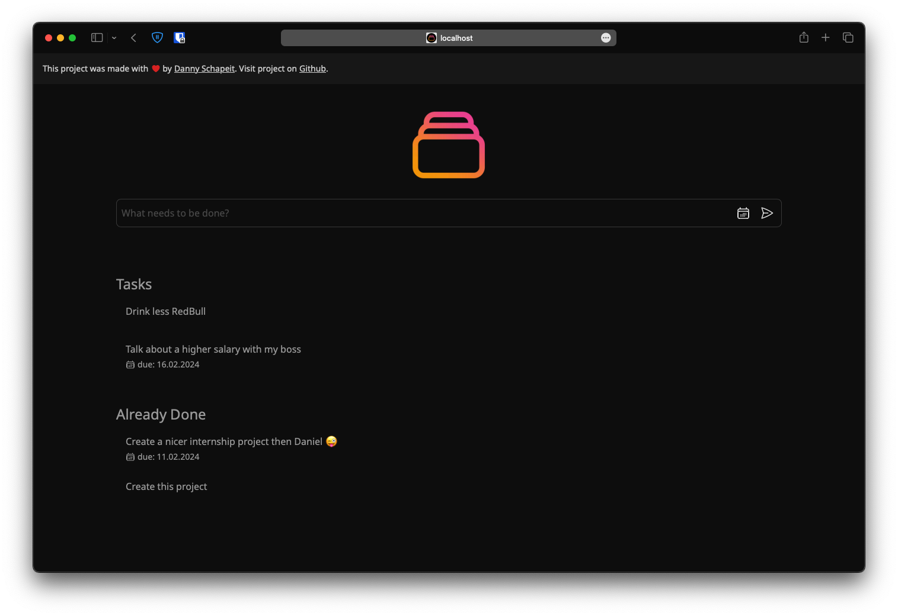

<p align="center">
    
</p>

This is a [Next.js](https://nextjs.org/) Todo app with [Tailwind CSS](https://tailwindcss.com/) to demonstrate how a Todo app can be built with Next.js 14.

## Getting Started

First, run the development server:

```bash
npm ci
npm run dev
```

Secondly, run the api mock server:

```bash
cd /mock
npx json-server db.json -p 3001 # If needed accept package install

```

Open [http://localhost:3000](http://localhost:3000) with your browser to see the result.

## Tech Stack

- Next.js 14
- Tailwind CSS (Styling)
- JSON-Server (Mock API)
- SWR (Dynamic data fetching)
- Next.js Server Actions (Handle task interactions)

## Features

- Add a new task
- Mark a task as completed
- Delete a task

## Todos

- [ ] remove SWR and use Next.js Server Actions for data fetching
- [ ] fix list behavior when items are removed or added